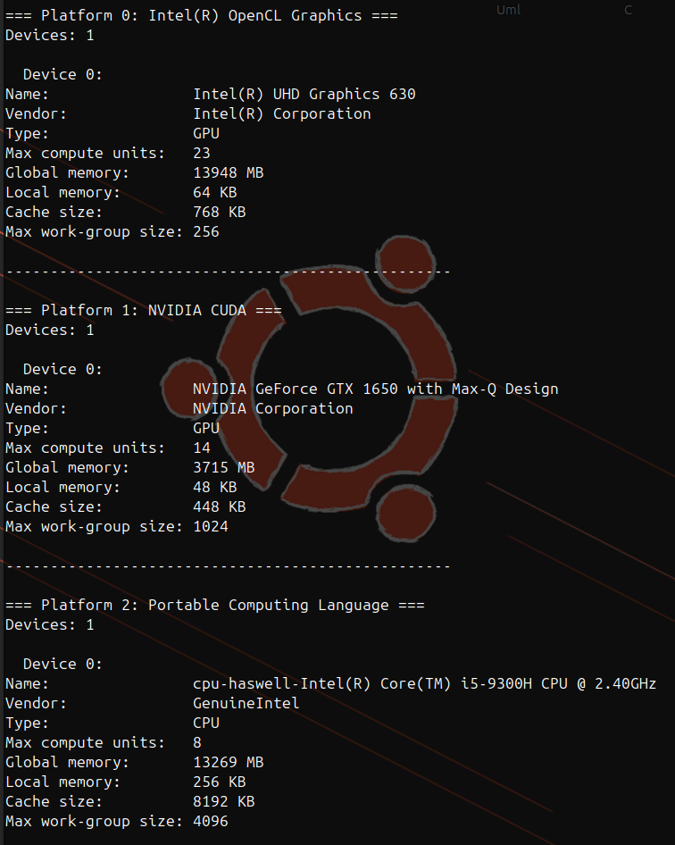

## Клонирование и сборка

```bash
git clone --recurse-submodules https://github.com/Matvey787/BitonicSort.git

cmake -S . -B build

cmake --build build
```

Доступные опции (запустите `./build/biton -h` или `./build/biton -help` для получения справки):

```bash
┌── /home/matvey/work/BitonicSort
└─► $ ./build/biton -h
Bitonic sort using OpenCL
Usage:
  biton [OPTION...]

  -f, --file arg    Input file with numbers to sort
  -c, --compare     Compare with std::sort
  -h, --help        Print usage
      --dev         Show selected OpenCL device
      --shdevs      Show all available OpenCL devices
  -s, --select arg  Select device by platform and device index (format: 
                    <platformIdx>:<deviceIdx>) (default: auto)
```

Итак, посмотрите доступные устройства и платформы OpenCL:

```bash
./build/biton --shdevs
```

Должно вывести что-то подобное:



Здесь виден индекс каждого устройства и индекс его платформы.

Чтобы выброть платформу и устройство для сортировки, используйте опцию `-s` или `--select`. По умолчанию программа пытается выбрать устройство автоматически, с приоритетом для GPU.

`Intel(R) UHD Graphics 630` некорректно работает с индексным просранством, поэтому я указываю явно `NVIDIA GeForce GTX 1650` (платформа 1, устройство 0):

Итак, запускаем сортировку:

```bash
# Просто отсортировать числа из файла test2.dat (без сравнения с std::sort)
./build/biton -s 1:0 --file tests/e2e/test2.dat

# Отсортировать числа из файла test2.dat и сравнить результат с std::sort
./build/biton -s 1:0 --file tests/e2e/test2.dat --compare

# Жесткий запуск с поставщиком только от nvidia
OCL_ICD_VENDORS=nvidia.icd ./build/biton --file tests/e2e/test2.dat --compare

```

## Установка opencl

```bash
sudo apt update

sudo apt install ocl-icd-libopencl1

sudo apt install pocl-opencl-icd

# Установите OpenCL для Intel GPU
sudo apt install intel-opencl-icd

# Установите OpenCL для CPU
sudo apt install pocl-opencl-icd
```

ls /etc/OpenCL/vendors/ - находим какие устройства видны и поддерживаются opencl
